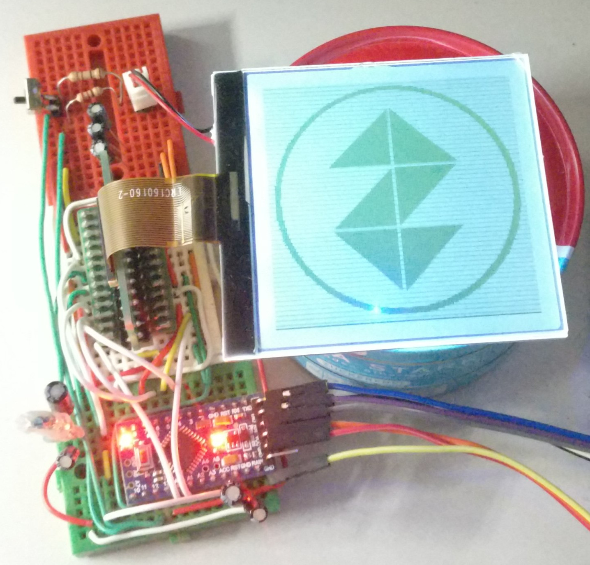

uc1698u-8080
============

A library for writing data to an LCD via the UC1698U LCD Driver in 8080 8-bit parallel mode.

Currently supports writing and reading (32-bit) shaded monochrome values and most driver commands.

Testing was done with a monochrome East Rising 160x160 LCD (ID: ERC160160). For other displays,
the init method needs to be adapted.

On linux the library can be installed by running `extra/install.sh`.

A simple example for writing an image to the display can be found in the `examples` directory.

Wiring for an arduino pro mini and other relevant documentation can be found in the `docs` directory.

